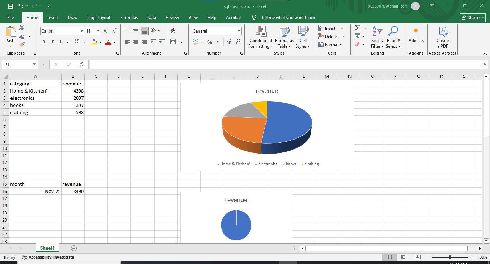

# E-commerce Analytics Project

## Overview
This project analyzes e-commerce sales data using SQL and visualizes insights in Excel.

## Database Schema
The database includes tables for:
- Customers
- Categories
- Products
- Orders
- Order Items
- Payments
- Reviews

## Key Insights
The following queries were used to generate insights:
- Category Revenue % (Pie Chart)
- Monthly Revenue Trend (Line Chart)
- Top Products by Revenue (Bar Chart)
- Top 5 Customers (Table + Bar Chart)

## Dashboard

## How to Run
1. Import `schema.sql` to create tables.
2. Insert sample data (`data.sql`).
3. Run queries from `queries.sql`.
4. View dashboard in Excel.

“Added README.md with project overview”.
